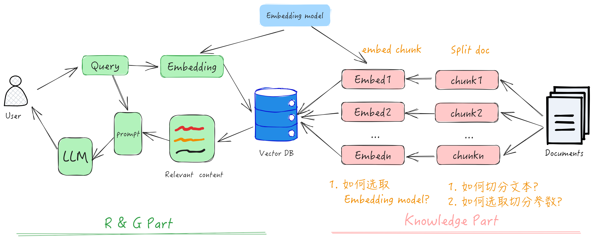
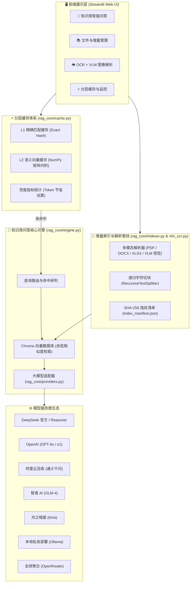

# 📚 RAG Studio 2.0 & LangChain 进阶实践系统

<p align="center">
  
</p>

<p align="center">
  <a href="#-核心特性矩阵"></a>
  <a href="#-快速开始"></a>
  <a href="#-核心特性矩阵"></a>
  <a href="#-多模型供应商生态"></a>
  <a href="#-自动化测试与质量保障"></a>
  <a href="LICENSE"></a>
</p>

<p align="center">
  <b>企业级个人知识库系统（RAG Studio 2.0） + 全栈 RAG 进阶技术实验指南</b>
</p>

---

## 📖 项目简介

**RAG_langchain** 是一个集 **「现代化个人知识库应用 (RAG Studio 2.0)」** 与 **「全流程 RAG 进阶技术实验平台」** 于一体的开源项目。

项目旨在解决大模型在落地私有知识问答时面临的**幻觉严重、Token 成本高昂、长文档响应慢、更新维护繁琐、多模态图表难以解析**等核心痛点，并结合 LangChain 生态与 Streamlit 打造了开箱即用的现代化交互工作台。同时，仓库内包含了业界最全的 RAG 核心技术深度实验（切块策略对比、嵌入模型评测、Parent Document Retriever、Ensemble 混合检索、Reranker 重排序、RAGAS 量化评估等），是学习与落地企业级 RAG 架构的绝佳参考。

---

## 🌟 核心特性矩阵

| 模块类别 | 核心特性 | 技术方案 / 实现位置 | 用户价值 |
|:---|:---|:---|:---|
| **多模态解析** | 👁️ **OCR + VLM 视觉大模型** | [`rag_core/vlm_ocr.py`](rag_core/vlm_ocr.py) | 支持架构图、流程图、扫描件与报表的高保真 Markdown 化解析，一键入库。 |
| **多格式支持** | 📄 **全文档格式统一解析** | [`rag_core/vlm_ocr.py`](rag_core/vlm_ocr.py) | 原生支持 PDF、DOCX、XLSX、XLS、CSV、JSON、TXT、Markdown 及常见图片。 |
| **增量索引** | 🔄 **SHA-256 指纹增量去重** | [`rag_core/indexer.py`](rag_core/indexer.py) | 重复文件秒级跳过（**0 计算、0 Token 消耗**）；文件修改自动原子更新并清理旧向量。 |
| **目录同步** | 📁 **本地目录一键同步** | [`rag_core/indexer.py`](rag_core/indexer.py) | 自动扫描本地文件夹（如 `data/`），新增、更新、删除一键与向量库精准对齐，防误删隔离。 |
| **分层缓存** | ⚡ **L1 精确哈希匹配** | [`rag_core/cache.py`](rag_core/cache.py) | 对标准化完全一致的问题实现 **0ms 极速响应、0 Token 消耗**。 |
| **语义缓存** | 🎯 **L2 向量矩阵并行内积** | [`rag_core/cache.py`](rag_core/cache.py) | 基于本地 Embedding + NumPy 矩阵向量化运算，毫秒级召回相近语义问答，阈值动态可调。 |
| **问答工作台** | 💬 **流式交互与置信度溯源** | [`kb_app.py`](kb_app.py) | 实时打字机流式回答，展示命中徽标（L1/L2/Chroma），提供可折叠精准切片与来源溯源。 |
| **监控看板** | 📊 **性能统计与 Token 节省** | [`kb_app.py`](kb_app.py) | 实时监控查询总量、L1/L2 命中数、综合命中率与预估节省的 Token 数量。 |
| **多模型生态** | 🌐 **主流大模型开箱即用** | [`rag_core/providers.py`](rag_core/providers.py) | 原生适配 DeepSeek、OpenAI、阿里千问、智谱清言、月之暗面 Kimi、Ollama、OpenRouter 及自定义。 |
| **数据分析** | 📈 **Pandas Agent 数据助手** | [`agent/chat_csv.py`](agent/chat_csv.py) | 独立的数据与大文档智能分析工具，支持自然语言执行表格统计与超长文档截断防护。 |

---

## 🏛️ 系统架构图



---

## 🚀 快速开始

### 1. 克隆项目与环境准备

本项目支持标准 Python 虚拟环境与极速包管理工具 [`uv`](https://github.com/astral-sh/uv)（推荐）。要求 Python **3.10** 及以上版本。

```bash
# 克隆仓库
git clone https://github.com/blackinkkkxi/RAG_langchain.git
cd RAG_langchain

# 方式 A：使用 uv（推荐，极速安装）
uv venv
# Windows 激活
.venv\Scripts\activate
# 安装依赖
uv pip install -r requirements.txt

# 方式 B：使用传统 pip
python -m venv .venv
# Windows 激活
.venv\Scripts\activate
# 安装依赖
pip install -r requirements.txt
```

### 2. 环境变量配置（可选，亦可在 Web UI 中直接填入）

复制根目录的 `.env.example` 模板为 `.env`，填入您的大模型 API 密钥：

```bash
copy .env.example .env
```

`.env` 文件支持的常用模型服务商：
```env
# 1. DeepSeek 官方 API (高性价比推荐)
DEEPSEEK_API_KEY=sk-xxxxxx

# 2. OpenAI 官方 API
OPENAI_API_KEY=sk-xxxxxx

# 3. 阿里云百炼 (通义千问)
DASHSCOPE_API_KEY=sk-xxxxxx

# 4. 智谱 AI (GLM)
ZHIPUAI_API_KEY=your_key_here

# 5. 月之暗面 (Kimi)
MOONSHOT_API_KEY=sk-xxxxxx

# 6. OpenRouter 全球模型聚合网关
OPENROUTER_API_KEY=sk-or-v1-xxxxxx
```

> 💡 **配置文件清晰分工（彻底消除重合与泄露隐患）**：
> 
> | 配置文件 | 唯一职责定位 | 包含内容 | 存储机制与说明 |
> |:---|:---|:---|:---|
> | **`.env`** | **统一凭据中心 (Secrets)** | 仅存各大模型 API Key（如 `DEEPSEEK_API_KEY`） | 本地独立环境变量文件（`.gitignore` 已排除），前端页面填入 Key 会自动安全回写至此处，刷新绝对不丢 |
> | **`.kb_config.json`** | **界面状态中心 (UI Preferences)** | 选中的服务商、自定义模型名称、Base URL、Temperature、Top-K | 纯 UI 交互状态记忆，**绝不存储任何 API Key**，刷新自动恢复控件选项 |

---

## 🖥️ 启动与使用说明

### 1. 启动全功能个人知识库 Web UI（核心应用）

```bash
# 推荐命令
uv run streamlit run kb_app.py

# 或标准命令
streamlit run kb_app.py
```
启动后，浏览器将自动打开 `http://localhost:8501`。

#### 💡 Web 界面 4 大功能模块指南
1. **💬 知识库智能问答**：
   - 在左侧侧边栏选择模型服务商（如 DeepSeek），输入 API Key 与自定义模型名称（如 `deepseek-chat` 或 `deepseek-reasoner`）。
   - 在输入框键入您的问题，系统将展示打字机流式回答，并高亮标注命中策略（🟢 L1 精确命中 / 🔵 L2 语义命中 / 🟡 Chroma 检索召回）。
   - 下方展开卡片清晰呈现文档切片来源、对应页码/工作表、相似度百分比与原文字段。
2. **📚 文件与增量管理**：
   - **上传入库**：拖拽任意多份文件（PDF、Word、Excel、CSV、TXT、MD 等），自动提取并增量索引入库。
   - **目录对齐 (/schedule)**：填入本地文件夹路径（如 `data`），点击「执行全量增量同步」，自动扫描所有变动，已处理文件秒级跳过，已删除文件自动移出向量库。
   - **文档看板**：表格展示当前知识库所有文档的切片数、更新时间、文件体积与入库来源，支持单个文档一键下架删除。
3. **👁️ OCR + VLM 图像解析**：
   - 上传图片或扫描件（PNG / JPG / WEBP 等），右侧实时高清预览。
   - 可输入自定义 Prompt（默认针对表格提取 Markdown，针对架构图提取结构与逻辑关系）。
   - 解析完成后，支持一键将排版好的 Markdown 存入知识库，立即支持检索问答。
4. **⚡ 分层缓存与性能监控**：
   - 顶部指标卡片直观显示：**总查询数、L1 命中、L2 命中、综合命中率、预估节省的 Token 数量**。
   - 动态滑块调节 L2 语义相似度阈值（默认 `0.92`，可在 `0.75 ~ 0.99` 间无缝调节）。
   - 查看近期的问答命中流水账，支持一键重置清空缓存。

---

### 2. 启动轻量数据分析与文档分析助手 (Agent)

```bash
uv run streamlit run agent/chat_csv.py
```
* **表格分析模式**：上传 CSV、Excel、JSON，通过 Pandas Agent 自动编写并运行 Python 代码进行统计计算、数据分组、指标汇总。
* **长文档模式**：上传 PDF、Word、TXT、MD 文档，内置超长文档保护机制（超过 10,000 字符智能截断提示，防止 Token 爆炸），支持流式回答。

---

## 🌐 多模型供应商生态

项目通过 [`rag_core/providers.py`](rag_core/providers.py) 实现了对主流大模型服务商的无缝兼容：

| 服务商 | Base URL 示例 | 默认模型推荐 | 特性说明 |
|:---|:---|:---|:---|
| **DeepSeek** | `https://api.deepseek.com/v1` | `deepseek-chat` | 性价比极高，支持 `deepseek-reasoner` (R1) 深度推理 |
| **OpenAI** | `https://api.openai.com/v1` | `gpt-4o-mini` | 支持 GPT-4o、o1、o3-mini，生态最成熟 |
| **通义千问 (DashScope)** | `https://dashscope.aliyuncs.com/compatible-mode/v1` | `qwen-plus` | 阿里百炼兼容接口，中文语境与长上下文能力优异 |
| **智谱 AI (GLM)** | `https://open.bigmodel.cn/api/paas/v4` | `glm-4-flash` | GLM 系列模型，响应迅速 |
| **月之暗面 (Kimi)** | `https://api.moonshot.cn/v1` | `moonshot-v1-8k` | 擅长中文长文本阅读与精细理解 |
| **Ollama (本地私有部署)** | `http://localhost:11434/v1` | `llama3.1` | **完全本地离线运行，无需消耗 API 额度，数据不出内网** |
| **OpenRouter** | `https://openrouter.ai/api/v1` | `deepseek/deepseek-chat` | 全球模型聚合网关，一个 Key 畅连数百种模型 |
| **自定义兼容接口** | 用户自定义 | 用户自定义 | 兼容任何符合 OpenAI 规范的 API 转发地址或自建网关 |

---

## 🎓 RAG 进阶技术学习与实验指南

本项目不仅是一个开箱即用的软件系统，更是系统的 RAG 进阶教学代码库。仓库中的 Notebook 实验涵盖了从基础切分到高级生产策略的全流程：

```
learn/
├── doc_loader/                     # 1. 多类型文档解析实战
│   ├── PDF_loader.ipynb            #    - PyPDF / PDFPlumber / Unstructured 深度对比
│   └── pdf_parse.ipynb             #    - PDF 复杂表格与版面分析
├── text_splitter/                  # 2. 文本分块策略与深度评测
│   ├── textspliter_ex.ipynb        #    - 递归字符切分 / Token 级切分 / Markdown 结构切分
│   └── text_splitterex2.ipynb      #    - 中文标点感知分块实践
├── chunsize/                       # 3. 块大小 (Chunk Size) 对比实验
│   ├── chunk_size.ipynb            #    - Chunk Size 对检索召回率与 LLM 理解度的影响
│   └── visual_semantic_chunking.ipynb # - 基于语义断点的可视化切分实验
├── embedding_model/                # 4. 向量化模型与多模态检索
│   ├── embedd.ipynb                #    - OpenAI、HuggingFace 与 BGE 嵌入模型评测
│   └── Gemini_Embedding_2_Multimodal_Retrieval.ipynb # - 多模态向量检索实战
├── advanced_method/                # 5. 高阶高级检索架构 (Advanced RAG)
│   ├── 01_multi_query.ipynb        #    - Multi-Query 检索生成扩充（查询改写与召回扩充）
│   ├── 02_contextual-compression.ipynb # - 上下文压缩检索（去除无关冗余文本）
│   ├── 03_EnsembleRetriever.ipynb  #    - 集成检索（BM25 稀疏检索 + 向量密集检索倒数融合 RRF）
│   ├── 04_long_contexts.ipynb      #    - Lost in the Middle 长上下文注意力衰减与重排优化
│   └── 05_Parent_Document_Retriever.ipynb # - 父子文档检索（小切片检索匹配，大段落传给 LLM）
├── reranker/                       # 6. 重排序检索优化
│   └── rerank.ipynb                #    - Cohere Rerank / BGE-Reranker 二阶段高精度重排序
└── evaluation/                     # 7. RAG 量化评估体系
    └── RAGAS-langchian.ipynb       #    - RAGAS 框架四大指标实测（忠实度、答案相关度、上下文精确率与召回率）
```

> 📖 **完整学习路线与实验说明** 请参阅：[RAG 进阶学习路线图 (`docs/LEARNING_ROADMAP.md`)](docs/LEARNING_ROADMAP.md)。

---

## 🧪 自动化测试与质量保障

项目配备了严格的自动化测试体系，覆盖单元测试与全功能端到端验证，确保在各种平台和边界条件下的可靠性：

```bash
# 运行全功能端到端测试套件（涵盖多模态、增量索引、分层缓存、引擎检索、Streamlit AppTest）
uv run python tests/test_full_features.py

# 运行核心单元测试套件
uv run python -m unittest tests/test_kb_system.py
```

### 自动化测试覆盖清单
- ✅ **Test 1: 多格式与多模态解析**（验证 TXT、MD、CSV、JSON、XLSX、DOCX 及图片 Base64 解析）
- ✅ **Test 2: SHA-256 增量索引与目录同步**（验证 `NEW` -> `SKIPPED` -> `UPDATED` -> 物理删除与防误删隔离机制）
- ✅ **Test 3: 分层缓存体系**（验证 L1 精确哈希、L2 矩阵向量化余弦相似度、Token 节省统计与阈值更新）
- ✅ **Test 4: 知识库问答核心引擎**（验证 Chroma 检索、相似度计算、多轮对话组装与流式生成输出）
- ✅ **Test 5: Streamlit Web UI 无头渲染测试**（基于 Streamlit `AppTest` 验证 4 大 Tab、侧边栏配置与状态切换）

---

## 📂 项目完整目录结构

```text
RAG_langchain/
├── README.md                       # 项目主文档（本文件）
├── kb_app.py                       # 核心应用：个人知识库 Web UI (RAG Studio 2.0)
├── requirements.txt                # 项目全量依赖清单
├── .env.example                    # 环境变量配置模板
├── .gitignore                      # Git 忽略配置（已忽略私有凭据、数据库与缓存）
├── rag_core/                       # 核心业务逻辑模块
│   ├── __init__.py                 # 核心模块导出
│   ├── providers.py                # 统一模型服务商配置（8 大主流供应商定义）
│   ├── indexer.py                  # SHA-256 增量索引器与目录对齐管理
│   ├── cache.py                    # 分层缓存系统（L1 精准 + L2 NumPy 矩阵语义内积）
│   ├── engine.py                   # 知识库问答核心引擎（Chroma 余弦检索与流式装配）
│   └── vlm_ocr.py                  # 全格式文档解析器与 VLM 多模态视觉解析
├── agent/                          # 智能数据分析助手
│   ├── chat_csv.py                 # Streamlit 数据与文档智能分析助手
│   ├── rag_loop.ipynb              # 循环检索 Agent 实验
│   └── tool_call/                  # 工具调用与函数调用实验
├── docs/                           # 深度技术文档目录
│   ├── ARCHITECTURE.md             # 系统技术架构与核心算法深度解析
│   ├── GETTING_STARTED.md          # 详细图文快速上手与实操指南
│   └── LEARNING_ROADMAP.md         # RAG 进阶学习路线图与 Notebook 实验指南
├── learn/                          # 系统化 RAG 教程与进阶代码库
│   ├── doc_loader/                 # 文档加载与解析
│   ├── text_splitter/              # 文本切块策略
│   ├── embedding_model/            # 向量表示模型
│   ├── advanced_method/            # 高级检索方法 (Parent-Doc / Ensemble / Multi-Query)
│   ├── reranker/                   # 语义重排序
│   ├── evaluation/                 # RAGAS 评估体系
│   └── Long-Context-RAG/           # 长上下文 RAG 研究
├── chunsize/                       # 块大小参数深度对比分析
├── langsmith/                      # LangSmith 追踪与 RAGAS 数据集
├── embedding_test/                 # 向量相似度测验与脚本
├── tests/                          # 自动化测试套件
│   ├── test_kb_system.py           # 基础模块单元测试
│   └── test_full_features.py       # 端到端全链路全功能集成测试
└── data/                           # 示例数据与基准文档库
```

---

## 🛡️ 安全规范与注意事项

1. **API Key 安全保护**：
   - 本项目通过 `base64` 混淆算法与 `.env` 机制管理密钥，本地配置文件 [`.kb_config.json`](.kb_config.json) 已由 `.gitignore` 排除，切勿将包含真实密钥的文件提交至公开仓库。
2. **Pandas Agent 代码执行安全**：
   - [`agent/chat_csv.py`](agent/chat_csv.py) 中开启了 `allow_dangerous_code=True` 用于执行本地数据统计运算。该工具仅供本地受信任环境下个人使用，切勿直接无保护暴露到不可信公网环境中。

---

## 🤝 贡献与开源协议

欢迎提交 Issue 或 Pull Request 为本项目添砖加瓦！  
本项目采用 [MIT License](LICENSE) 开源协议。
