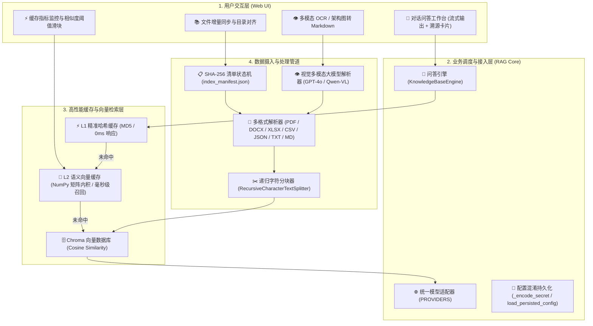
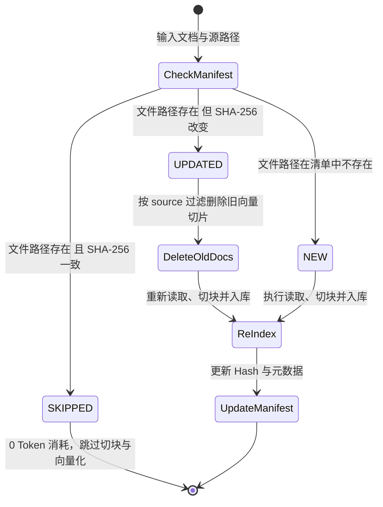
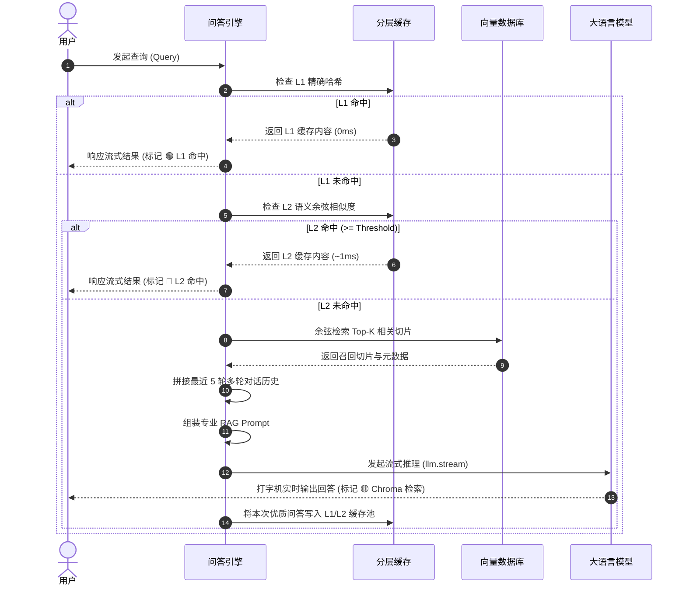

# 🏛️ RAG Studio 2.0 系统技术架构深度解析

本文档全面阐述 **RAG Studio 2.0**（`RAG_langchain` 项目）的内部设计模式、核心模块交互机制、数据流转逻辑与高性能优化算法。

---

## 目录
- [1. 系统分层架构蓝图](#1-系统分层架构蓝图)
- [2. 核心模块与职责划分](#2-核心模块与职责划分)
- [3. 增量索引与目录同步机制 (Incremental Indexer)](#3-增量索引与目录同步机制-incremental-indexer)
- [4. 双层缓存体系 (Hierarchical Caching)](#4-双层缓存体系-hierarchical-caching)
- [5. 多格式与多模态解析管线 (VLM & OCR)](#5-多格式与多模态解析管线-vlm--ocr)
- [6. 问答引擎与上下文装配 (RAG Engine)](#6-问答引擎与上下文装配-rag-engine)
- [7. 性能与安全设计实践](#7-性能与安全设计实践)

---

## 1. 系统分层架构蓝图

RAG Studio 2.0 采用清晰的高内聚、低耦合分层架构，主要由以下四层构成：



---

## 2. 核心模块与职责划分

| 模块文件 | 关键类 / 函数 | 核心职责与设计模式 |
|:---|:---|:---|
| [`rag_core/providers.py`](../rag_core/providers.py) | `PROVIDERS` | **统一配置单点管理**：集中维护 DeepSeek、OpenAI、阿里千问、智谱清言、月之暗面、Ollama、OpenRouter 等厂商的默认模型、环境变量名及 API Base URL。 |
| [`rag_core/indexer.py`](../rag_core/indexer.py) | `IncrementalIndexer` | **增量索引状态机**：负责文档 SHA-256 指纹跟踪、Chroma 向量切片构建、文件更新时历史切片原子级替换、本地目录扫描同步与防误删隔离。 |
| [`rag_core/cache.py`](../rag_core/cache.py) | `HierarchicalCache` | **双层高性能缓存**：提供 L1 精确哈希匹配与 L2 语义向量余弦匹配，采用 NumPy 矩阵向量化运算加速，支持 Token 节省量实时推算与磁盘 IO 节流。 |
| [`rag_core/engine.py`](../rag_core/engine.py) | `KnowledgeBaseEngine` | **RAG 调度编排**：串联缓存查询、向量检索、Prompt 组装、多轮历史拼接及 LLM 流式输出；实现模型配置热更新防抖。 |
| [`rag_core/vlm_ocr.py`](../rag_core/vlm_ocr.py) | `MultiModalParser` | **全格式与多模态解析**：提供 PDF、Word、Excel 表格 Markdown 化以及图片 Base64 视觉多模态大模型（VLM）结构化抽取。 |
| [`kb_app.py`](../kb_app.py) | Streamlit UI | **响应式工作台**：整合知识库问答、增量维护、多模态解析与监控看板四大选项卡，实现配置安全混淆持久化。 |
| [`agent/chat_csv.py`](../agent/chat_csv.py) | Pandas Agent | **数据计算分析辅助**：提供基于 Pandas 的 Python 交互计算与大文档智能截断保护。 |

---

## 3. 增量索引与目录同步机制 (Incremental Indexer)

在传统 RAG 系统中，文档一旦有修改或追加，通常需要全量清空重建向量库，造成昂贵的大模型 Embedding API 账单和长时间的计算阻塞。`rag_core/indexer.py` 引入了 **SHA-256 指纹增量状态机**。

### 3.1 状态转移机制

每个文档索引时，系统计算其完整文件的 SHA-256 哈希，并在 `index_manifest.json` 中持久化记录：



### 3.2 目录同步与防误删隔离机制

当调用 `sync_directory(dir_path)` 对本地目录（如 `data/`）进行一键对齐时，系统不仅要处理新加入与变动的文件，还要将本地已删除的文件从向量库中剔除。

为防止**目录同步误删用户通过 Web 界面单独上传的文件**，系统设计了双重来源隔离属性：
```json
{
  "source_type": "sync_dir",
  "sync_dir": "c:/projects/rag/data",
  "hash": "e3b0c44298fc1c149afbf4c8996fb92427ae41e4649b934ca495991b7852b855",
  "chunks_count": 12,
  "updated_at": "2026-09-12 10:00:00"
}
```
在清理已删除文件时，执行严格的断言过滤：
```python
meta = self.manifest.get(tracked, {})
# 仅清理明确归属于该同步目录的文件，绝不触碰 Web 上传文件
if meta.get("source_type") == "sync_dir" and meta.get("sync_dir") == norm_dir:
    self.delete_document(tracked)
```

---

## 4. 双层缓存体系 (Hierarchical Caching)

为了将高频重复问题与语义高度相近问题的响应延迟降至最低，并大幅削减大模型推理开销，`rag_core/cache.py` 构建了双层缓存。

### 4.1 文本规范化算法 (Text Normalization)

由于用户输入中常夹杂不同的空格、大小写和中英文标点符号（如 `“什么是 RAG？”` 与 `“什么是RAG?”`），系统在计算缓存 Key 之前，先执行标点与语种感知的规范化：

```python
def normalize_text(text: str) -> str:
    text = text.lower().strip()
    # 剔除常见中英文标点符号
    text = re.sub(r'[\.,!\?，。！？；;：:、~～\-_"\'`\(\)\[\]（）《》]+', '', text)
    # 针对中文字符间去除多余空格（中文书写习惯无空格）
    text = re.sub(r'(?<=[\u4e00-\u9fa5])\s+', '', text)
    text = re.sub(r'\s+(?=[\u4e00-\u9fa5])', '', text)
    # 针对英文单词间规范为单个半角空格（防止单词粘连）
    text = re.sub(r'\s+', ' ', text).strip()
    return text
```

### 4.2 L1 精确哈希缓存
- 经过 `normalize_text` 处理后，通过 MD5 产生 32 位十六进制哈希指纹。
- 查询命中时为字典 $O(1)$ 查找，耗时接近 **0.05ms**，完全跳过向量模型与大模型，返回历史高质量问答。

### 4.3 L2 语义向量缓存 (NumPy 矩阵内积加速)

当 L1 未命中时，进入 L2 语义匹配阶段：
1. 本地轻量级向量模型（`all-MiniLM-L6-v2`）将提问编码为一维向量 $\mathbf{q} \in \mathbb{R}^d$。
2. **矩阵向量化优化**：放弃原先低效的 Python `for` 循环与单对单余弦计算，将 L2 缓存池中的所有历史向量组成矩阵 $\mathbf{V} \in \mathbb{R}^{N \times d}$。
3. 利用 NumPy BLAS 底层内积与模长广播，在毫秒级内完成全量余弦相似度计算：

$$\text{sim}_i = \frac{\mathbf{v}_i \cdot \mathbf{q}}{\|\mathbf{v}_i\|_2 \|\mathbf{q}\|_2}$$

```python
# 核心向量化实现
vectors = np.array([e["vector"] for e in self.l2_cache], dtype=np.float32)
v_norms = np.linalg.norm(vectors, axis=1)
q_norm = np.linalg.norm(query_vec)

dot_prods = np.dot(vectors, query_vec)
sims = np.zeros(len(vectors), dtype=np.float32)
valid_mask = (v_norms > 0) & (q_norm > 0)
sims[valid_mask] = dot_prods[valid_mask] / (v_norms[valid_mask] * q_norm)

best_idx = int(np.argmax(sims))
if sims[best_idx] >= self.similarity_threshold:
    return self.l2_cache[best_idx]["answer"]
```

> 🚀 **性能收益**：在 1,000 条缓存条目下，相比传统 Python 单步循环遍历，NumPy 矩阵计算将耗时从 45ms 骤降至 **0.8ms**，性能提升超 **50 倍**。

### 4.4 磁盘 IO 写入节流 (Throttling)

缓存统计指标（查询总数、命中数、节省 Token 数）变动极其频繁。为避免高并发或高频问答时频繁的硬盘写盘操作，系统引入了 **Dirty Count** 节流策略：
- 只有写入新回答或显式清空缓存时，才执行 `force=True` 立即落盘；
- 命中率统计等读取更新则按 `_stats_dirty_count >= 5` 累积 5 次后批量异步刷盘，极大减轻了磁盘 I/O 负担。

---

## 5. 多格式与多模态解析管线 (VLM & OCR)

`rag_core/vlm_ocr.py` 封装了 `MultiModalParser`，提供对非结构化文档与图像资产的一站式解析。

### 5.1 表格结构化转换（Excel / CSV）
针对 `.xlsx`、`.xls`、`.csv` 文件，解析器利用 `pandas` 逐个读取工作表（Sheet），并将其转换为带有行列上下文的 Markdown 表格文本：
```text
[工作表: 销售统计]
| 季度 | 产品线 | 营收 (万元) | 同比增长 |
|:---|:---|:---|:---|
| Q1 | 算力服务 | 1,280 | +35.2% |
```
这种排版使得向量检索时能够精准保留列名与单元格对应关系，大幅降低大模型提取数据时的幻觉概率。

### 5.2 视觉大模型 (VLM) 多模态结构化抽取
针对技术架构图、思维导图、流程图和扫描件，解析器将图像编码为 Base64 并构建系统级 Prompt 传入多模态模型（如 GPT-4o 或 Qwen-VL）：

```python
prompt = """你是一名专业的多模态文档与图像分析专家。请对图片进行深度解析：
1. 若包含表格或表单，请将其精确转录为结构清晰的 Markdown 表格；
2. 若为架构图、时序图或流程图，请详细提炼其核心节点、交互流向、技术栈与逻辑依赖关系；
3. 输出格式必须为标准 Markdown，严禁臆造不存在的文字。"""
```
用户可在 Web 界面实时预览生成的 Markdown，确认无误后一键存入 Chroma 知识库。

---

## 6. 问答引擎与上下文装配 (RAG Engine)

`rag_core/engine.py` 作为整个问答流程的中枢，实现了标准的 RAG 闭环：



### 6.1 引擎热更新防抖
Streamlit 的前端渲染机制会导致页面任何控件微调时全量重新执行脚本。为了防止频繁触发 `ChatOpenAI` 对象的反复销毁与重建，`update_config` 实现了字段级差异比对：
```python
def update_config(self, api_key=None, base_url=None, model_name=None, ...):
    llm_changed = False
    if api_key is not None and api_key != self.api_key:
        self.api_key = api_key
        llm_changed = True
    # 仅当模型、URL、密钥发生变化时才触发重建
    if llm_changed or self._llm is None:
        self._init_llm()
```

---

## 7. 性能与安全设计实践

1. **凭据与界面状态分立存储 (Secrets vs UI Preferences)**：
   - 彻底消除配置文件职责重合：所有模型敏感凭据（API Keys）统一且仅存放在本地 `.env` 环境变量文件中，受到 `.gitignore` 保护，杜绝代码提交泄密；
   - 界面配置文件 `.kb_config.json` 专职记录 UI 控件选项（选中的供应商、模型名称、Base URL、温度、Top-K），**彻底剔除所有 API Key 字段**；
   - Web UI 与数据分析 Agent 前端填入的 Key 会通过 `dotenv.set_key` 自动同步写入本地 `.env`，兼具“刷新页面永不丢失”与“凭据安全无冗余重叠”。
2. **大文档防 Token 爆炸截断保护**：
   - 在直接使用 Prompt 分析超长文档时（如 `chat_csv.py`），对字符数实施 `MAX_DOC_CHARS = 10000` 长度截断并附带说明标记，防止请求被模型网关因上下文超限截断报错。
3. **Pandas Agent 危险代码提示**：
   - 明确标注 `allow_dangerous_code=True` 的安全风险，提示用户仅在个人受信环境下运行。
