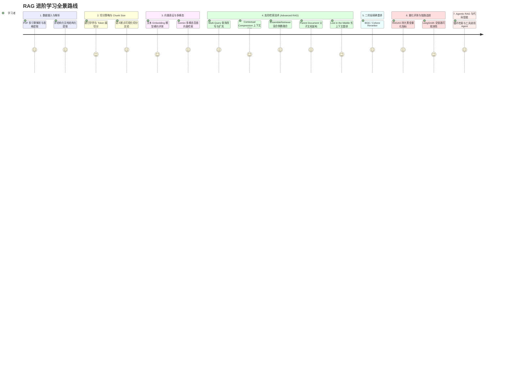

# 🎓 RAG 进阶技术全栈学习路线与实验指南

本项目仓库除了提供开箱即用的个人知识库系统（RAG Studio 2.0）之外，还沉淀了目前工业界与学术界最全面、最成体系的 **RAG 核心技术 Notebook 实验代码库**。

本文档为您梳理一条从「基础文档解析与分块」到「进阶高级检索与重排序」、再到「量化评估与 Agentic RAG」的系统化学习路线图。

---

## 🧭 学习路线总览

---

## 阶段一：文档加载与版面解析 (`learn/doc_loader/`)

高质量的检索召回首先取决于文本摄入阶段的解析精度。很多 PDF 存在双栏排版、复杂图表及页眉页脚干扰。

### 实验列表与核心知识点
1. **[`learn/doc_loader/PDF_loader.ipynb`](../learn/doc_loader/PDF_loader.ipynb)**：
   - 对比 `PyPDFLoader`、`PDFPlumberLoader` 与 `UnstructuredPDFLoader` 在处理学术论文与研报时的表现；
   - 学习如何过滤无用元数据与不可见字符。
2. **[`learn/doc_loader/pdf_parse.ipynb`](../learn/doc_loader/pdf_parse.ipynb)**：
   - 针对包含密集表格的研报（如 `layout-parser-paper-fast.pdf`），演示如何结合版面分析（LayoutParser）抽离结构化 Markdown 表格，避免传统纯文本提取导致的行列混淆。

---

## 阶段二：文本分块策略与 Chunk Size 科学实验 (`learn/text_splitter/` & `chunsize/`)

切块（Chunking）是 RAG 系统性能的第一道分水岭：切块太小会导致上下文语义断裂；切块太大则会导致向量表征模糊，且检索召回过多无关冗余。

### 实验列表与核心知识点
1. **[`learn/text_splitter/textspliter_ex.ipynb`](../learn/text_splitter/textspliter_ex.ipynb)**：
   - 比较 `CharacterTextSplitter` 与 `RecursiveCharacterTextSplitter` 的工作逻辑；
   - 探究 `chunk_overlap` 重叠窗口对保留段落边界语义的作用。
2. **[`learn/text_splitter/text_splitterex2.ipynb`](../learn/text_splitter/text_splitterex2.ipynb)**：
   - 中文标点感知切分实践：针对中文句号、问号、换行符制定专属分割优先级，避免将中文长句腰斩。
3. **[`chunsize/chunk_size.ipynb`](../chunsize/chunk_size.ipynb)**：
   - **核心基准实验**：使用同一篇文档在不同的 `chunk_size`（128、256、512、1024、2048）下进行向量化，横向评测其检索相关度与上下文完整度；
   - 解析仓库中附带的图表指标：
     - `chunsize VS LLM.png`：块大小对大语言模型理解完整度的边际递减效应；
     - `chunsize VS embe max tokens.png`：不同 Embedding 模型最大输入 Token 对块大小选型的约束。
4. **[`chunsize/visual_semantic_chunking.ipynb`](../chunsize/visual_semantic_chunking.ipynb)**：
   - 可视化语义切分（Visual Semantic Chunking）：计算相邻句子间的余弦相似度曲线，寻找语义突变的“断点波谷”作为天然分块边界。

---

## 阶段三：向量表征模型与多模态检索 (`learn/embedding_model/` & `embedding_test/`)

向量模型决定了语义空间对齐的精度。

### 实验列表与核心知识点
1. **[`learn/embedding_model/embedd.ipynb`](../learn/embedding_model/embedd.ipynb)**：
   - 涵盖 OpenAI `text-embedding-3-small`、HuggingFace 本地开源模型与 BAAI BGE 模型的性能与调用实践；
   - 分析维度截断（Dimensions Reduction）对检索召回的影响。
2. **[`learn/embedding_model/Gemini_Embedding_2_Multimodal_Retrieval.ipynb`](../learn/embedding_model/Gemini_Embedding_2_Multimodal_Retrieval.ipynb)**：
   - **多模态前沿实验**：利用 Gemini 多模态 Embedding 模型，将音频片段（`data/audio`）与图片帧（`data/images`）映射到同一多模态语义空间中，实现“文本搜音频”与“文本搜图像”的统一跨模态检索。
3. **[`embedding_test/cos_similarity.py`](../embedding_test/cos_similarity.py)**：
   - 余弦相似度、内积、欧氏距离三种度量标准的数学原理与本地代码实现。

---

## 阶段四：高级 RAG 检索架构 (Advanced RAG) (`learn/advanced_method/`)

朴素 RAG（Naive RAG）仅使用简单的“提问 -> 向量检索 -> 提示词拼接”，在复杂场景下极易失效。本模块包含 5 种目前工业界最主流的进阶检索模式：

### 实验列表与核心知识点
1. **[`learn/advanced_method/01_multi_query.ipynb`](../learn/advanced_method/01_multi_query.ipynb)（Multi-Query 多路改写召回）**：
   - 利用大模型从不同视角将用户的原始单一提问改写为 3~5 个语义相似但角度不同的子问题；
   - 分别发起并行检索并取并集去重，显著解决因用户用词不准导致的召回遗漏。
2. **[`learn/advanced_method/02_contextual-compression.ipynb`](../learn/advanced_method/02_contextual-compression.ipynb)（上下文压缩检索）**：
   - 召回的文本块通常包含大量与问题无关的修饰句；
   - 通过 `LLMChainExtractor` 或小模型在传入大模型前动态压缩文本，过滤噪音文本，降低 Token 消耗达 60% 以上。
3. **[`learn/advanced_method/03_EnsembleRetriever.ipynb`](../learn/advanced_method/03_EnsembleRetriever.ipynb)（混合集成检索）**：
   - 融合 **BM25 关键词稀疏检索**（擅长精确匹配专有名词、产品型号、数字）与 **Dense 密集向量检索**（擅长模糊语义理解）；
   - 使用倒数排序融合（Reciprocal Rank Fusion, RRF）算法计算最终权重，召回质量全面超越单一向量检索。
4. **[`learn/advanced_method/04_long_contexts.ipynb`](../learn/advanced_method/04_long_contexts.ipynb)（长上下文优化与注意力偏置）**：
   - 验证著名的“迷失在中间（Lost in the Middle）”现象：大模型对 Prompt 最前部和最后部的注意力最高，中间内容易被忽略；
   - 使用 `LongContextReorder` 将最相关的切片重新交替排列在 Prompt 的两头，大幅改善生成质量。
5. **[`learn/advanced_method/05_Parent_Document_Retriever.ipynb`](../learn/advanced_method/05_Parent_Document_Retriever.ipynb)（父子文档检索）**：
   - 巧妙分离“检索粒度”与“生成粒度”：将文档先切为大块（父文档），再在大块内切出微小切片（子文档）；
   - 向量库只存子切片进行精准匹配；一旦命中，自动通过 InMemoryStore 提取完整的父文档段落交付大模型，兼顾了匹配精度与语境完整度。

---

## 阶段五：重排序机制 (Reranker) (`learn/reranker/`)

### 实验与核心知识点
* **[`learn/reranker/rerank.ipynb`](../learn/reranker/rerank.ipynb)**：
  - 向量检索由于将整个切片压缩为单一向量，存在语义信息压缩损失；
  - 本实验引入二阶段高精度交叉编码器（Cross-Encoder，如 Cohere Rerank、bge-reranker-large）；
  - 先由向量检索粗筛 Top-20，再由 Reranker 精排挑选 Top-3 送入大模型，显著提高生成准确率。

---

## 阶段六：长上下文模型 vs 传统 RAG 的边界思考 (`learn/Long-Context-RAG/`)

### 实验与核心知识点
* **[`learn/Long-Context-RAG/RAG_no_embedding.ipynb`](../learn/Long-Context-RAG/RAG_no_embedding.ipynb)**：
  - 针对 Gemini-1.5-Pro、Claude 3.5 Sonnet 等具备百万 Token 上下文窗口的大模型，深度探究“免向量嵌入、直接全量塞入上下文”与“RAG 检索增强”在成本、吞吐率、首字延迟（TTFT）及大海捞针（Needle in a Haystack）准确率上的权衡。

---

## 阶段七：RAGAS 量化评估体系与 LangSmith 链路可观测性 (`learn/evaluation/` & `langsmith/`)

没有量化评估的 RAG 优化是“盲人摸象”。

### 实验列表与核心知识点
1. **[`learn/evaluation/RAGAS-langchian.ipynb`](../learn/evaluation/RAGAS-langchian.ipynb)**：
   - 使用 RAG 评估事实标准框架 **RAGAS**；
   - 自动化量化四大核心维度：
     - **Faithfulness (真实度/忠实度)**：回答是否完全来自检索上下文，严防胡编乱造；
     - **Answer Relevance (答案相关性)**：回答是否直接解决了用户提问；
     - **Context Recall (上下文召回率)**：检索切片是否包含了回答所需的全部要点；
     - **Context Precision (上下文精准率)**：检索切片中高价值信息是否排在最前列。
2. **[`langsmith/rag_langsmith.ipynb`](../langsmith/rag_langsmith.ipynb)**：
   - 对接 LangSmith 云端追踪平台，实时可观测每一次问答的检索时延、Token 计费流水、分块内容与 Prompt 模板。

---

## 阶段八：Agentic RAG 与代码智能计算 (`agent/`, `RLM/`, `mini_claude_code/`)

RAG 进阶的终局是赋予系统自主决策与工具执行能力。

### 实验与核心知识点
1. **[`agent/chat_csv.py`](../agent/chat_csv.py)**：
   - 基于 LangChain Experimental 的 `create_pandas_dataframe_agent`，让大模型自主生成并运行 Python 代码进行复杂统计计算。
2. **[`agent/rag_loop.ipynb`](../agent/rag_loop.ipynb)**：
   - 循环检索与自我纠错（Self-RAG / Corrective RAG 原型实验）：大模型自主判断检索切片是否充足，若不足则自主发起第二轮修正检索。
3. **[`RLM/rlm_0113.ipynb`](../RLM/rlm_0113.ipynb)** 与 **[`mini_claude_code/mini_claude_code.py`](../mini_claude_code/mini_claude_code.py)**：
   - 探索基于大语言模型自主阅读仓库结构、执行命令行工具、管理上下文并完成复杂多步骤编码任务的自主 Agent 架构。
